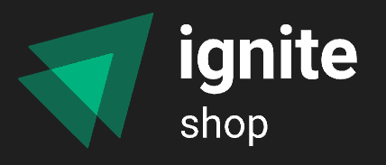
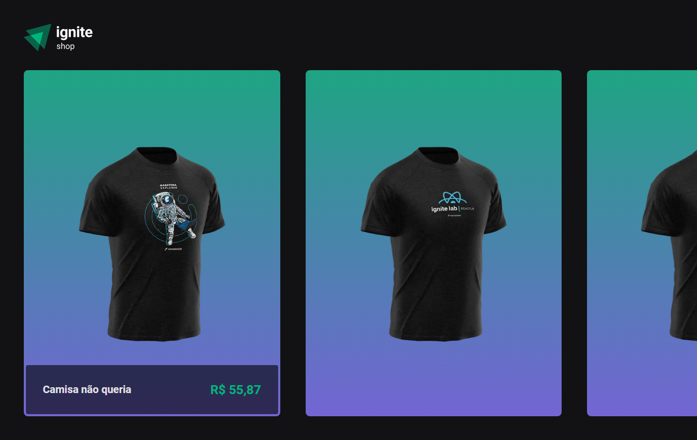
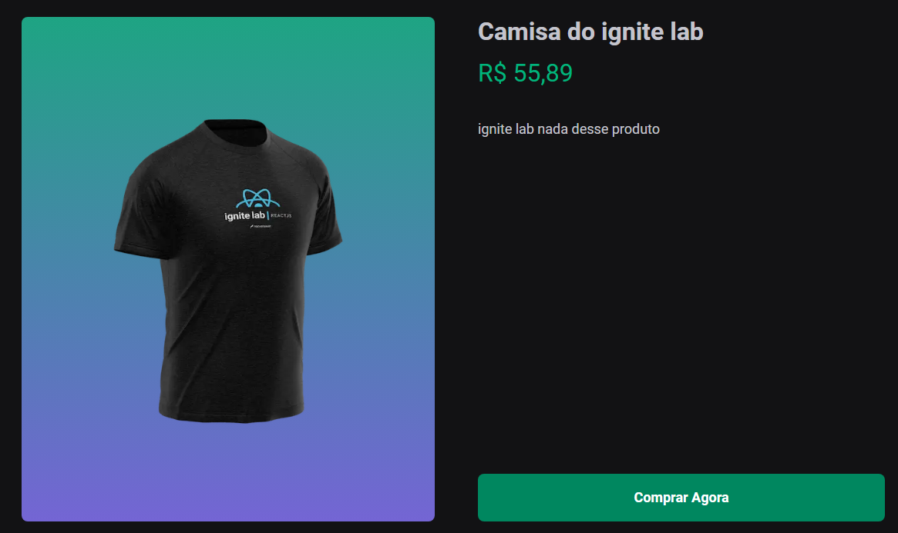
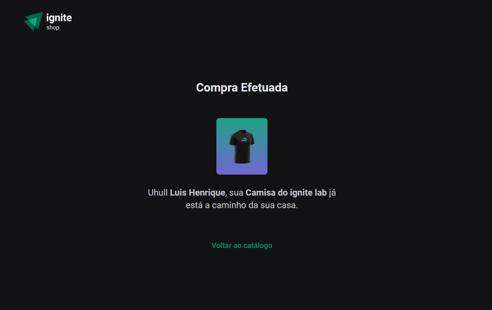

<h1 align="center">
  
</h1>

<h3 align="center">
  TheShop - An app to buy your clothes
</h3>

<h1 align="center">
  
  
  
</h1>

<p align="center">
  

  <a href="https://www.linkedin.com/in/luishng/">
    
  </a>

  

  <a href="https://github.com/luishng/theshop/commits/main">
    
  </a>

  <a href="https://github.com/luishng/theshop/issues">
    
  </a>

  
</p>

# :pushpin: Table of Contents

<p align="center">
  <a href="#recycle-about-the-project">About the project</a>&nbsp;&nbsp;&nbsp;|&nbsp;&nbsp;&nbsp;
  <a href="#-technologies">Technologies</a>&nbsp;&nbsp;&nbsp;|&nbsp;&nbsp;&nbsp;
  <a href="#-getting-started">Getting Started</a>&nbsp;&nbsp;&nbsp;|&nbsp;&nbsp;&nbsp;
  <a href="#-features">Features</a>&nbsp;&nbsp;&nbsp;|&nbsp;&nbsp;&nbsp;
  <a href="#-license">License</a>
</p>

## 🏋🏽💪🏼 About the project

This project was developed in Specialization from [Rocketseat](https://rocketseat.com.br/) &nbsp;🚀

This software is a web application, provide a way for the people to buy their clothes.

## 🚀 Technologies

**Language:**

- [TypeScript](https://www.typescriptlang.org/)

**Mobile:**

- [React](https://react.dev/) - React programming paradigm
- [Next.JS](https://nextjs.org/) - Framework
- [Stripe](https://stripe.com/br) - "Database" - PasS
- [Stitches](https://stitches.dev/) - Component Style CSS-in-JS
- [Keen Slider](https://keen-slider.io/) - Carousel used on Home Page

## 🔗 Features

- List of clothes;
- Product detail;
- Success Page

## 🏁 Getting Started

**Install the requirements**

- [Git](https://git-scm.com/)
- [Node.js](https://nodejs.org/en/)

**Clone project and access the folder**

```bash
$ git clone https://github.com/luishng/theshop.git && cd theshop
```

```bash
# Install the dependencies
$ npm i

# Put a .env.local in your project with your Stripe credentials. Check file (.env.local.example)

# Start the client
$ npm run dev
```

## 📝 License

This project is licensed under the MIT License - see the [LICENSE](LICENSE) file for details.

---

Made with 💜&nbsp; by [Luis Henrique](https://github.com/luishng) 👋 &nbsp;[See my linkedin](https://www.linkedin.com/in/luishng/) 👷
